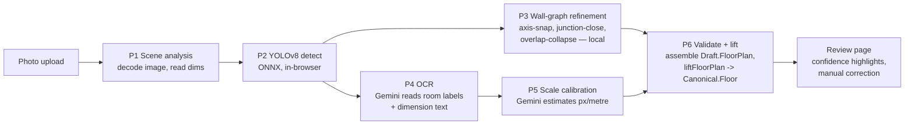
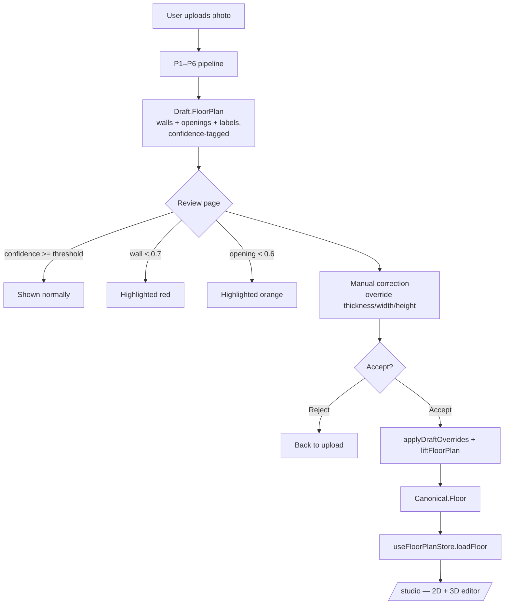

# Upload Flows

Corbel offers a single upload page (`/upload`, `src/components/upload/UploadPage.tsx`)
with a two-mode toggle. Both modes run the *same* P1–P6 detection pipeline
(`src/lib/services/importPipeline.ts`); they only differ in what happens to
the resulting `Canonical.Floor` after the user accepts it.

## Shared pipeline (P1–P6)



P3 (local, synchronous) and the P4→P5 network round trip run **concurrently** —
P3 has no dependency on OCR output, so the wall-graph refinement overlaps with
the Gemini call instead of waiting on it. P4 and P5 are a single request to
`/api/plan-import/ocr-scale`, which runs OCR then scale calibration
server-side and returns both.

Stage progress is reported via a callback (`onProgress: (p: StageProgress) => void`)
with cumulative percentages: P1 8% · P2 38% · P3 55% · P4 75% · P5 88% · P6 100%.

## Flow 1: Upload for Reconstruction (primary)



**Prose.** The user drops or selects a photo of a hand-drawn or printed floor
plan. The pipeline detects walls/doors/windows locally (YOLOv8n ONNX, no
server round trip for geometry), reads room labels and dimension text via
Gemini OCR, and calibrates a pixels-per-metre scale from whatever dimension
annotations it found. All of that is assembled into a `Draft.FloorPlan` —
loose, pixel-derived geometry converted to millimetres, every element
confidence-tagged.

The review page shows the source image alongside detection stats and a
correction list sorted lowest-confidence-first. Walls below 70% confidence
and openings below 60% are visually flagged so the user's attention goes
where the model is least sure. The user can select any wall or opening and
override its thickness/width/height directly — these overrides live on the
Draft (`overrideThickness`, `overrideWidth`, `overrideHeight`) and are folded
in via `applyDraftOverrides()` immediately before lifting.

Accepting re-runs `liftFloorPlan()` with the corrected Draft, producing a
topology-complete `Canonical.Floor` (axis-snapped walls, closed rooms,
openings attached to their host wall). That's loaded into
`useFloorPlanStore` via `loadFloor(canonical, library)`, and the user is
routed to `/studio`, the 2D/3D editor bound to the same store.

## Flow 2: Upload for Trace-to-Learn (baseline import)

```mermaid
flowchart TD
    U[User uploads reference photo] --> Pipe[P1–P6 pipeline\nsame as Reconstruction]
    Pipe --> D[Draft.FloorPlan]
    D --> Rev[Review / correction\nsame UI as Reconstruction]
    Rev --> Accept{Accept?}
    Accept -->|Reject| Restart[Back to upload]
    Accept -->|Accept| Lift[liftFloorPlan]
    Lift --> Canonical[Canonical.Floor]
    Canonical --> Load[loadFloor]
    Load --> Freeze[freezeAsGhost\ndeep-copies currentFloor\ninto ghostFloor — immutable]
    Freeze --> Prompt["Now redesign against this baseline"]
    Prompt --> Editor[/studio?mode=trace/\nCanvasEditor renders ghost\nat ghostOpacity]
```

**Prose.** Identical pipeline to Reconstruction — the only divergence is
after Accept. Instead of stopping at `loadFloor()`, the store's
`freezeAsGhost()` is called, which deep-copies the just-loaded
`currentFloor` into `ghostFloor`. The ghost is intentionally immutable:
nothing in the editor ever mutates `ghostFloor` again, it's a read-only
reference plan rendered at `ghostOpacity` (default 0.3) underneath the live
editable floor. The user is prompted to start redesigning, then routed to
`/studio?mode=trace`, which the editor uses to show a "trace mode" banner —
the live floor starts as a copy of the ghost's geometry conceptually, though
in the current build the user begins from the loaded Canonical.Floor and
edits it directly (draw/move/delete walls) while the ghost stays visible
for comparison. `src/lib/comparison/*` (existing) can score the diff between
`ghostFloor` and the live floor once redesign work begins.

## Decision tree: low confidence, correction, and failure handling

```mermaid
flowchart TD
    Start[Pipeline stage result] --> Q1{Stage succeeded?}
    Q1 -->|No, P1| E1[Throw: bad image / undecodable file\nUser re-selects file]
    Q1 -->|No, P2| E2[Throw: ONNX error or\nzero walls detected\nUser retries with clearer photo]
    Q1 -->|No, P4/P5 — OCR/scale| Deg[Degrade gracefully:\nocrFailed=true, use fixedScale\nor DEFAULT_PIXELS_PER_METRE=100\nWarning surfaced, not fatal]
    Q1 -->|No, P6| E3[Throw: lift algorithm error\nUser retries]
    Q1 -->|Yes| Q2{Element confidence}
    Q2 -->|wall >= 0.7| Normal[Render normally]
    Q2 -->|wall < 0.7| Red[Red highlight + warning entry]
    Q2 -->|opening >= 0.6| Normal2[Render normally]
    Q2 -->|opening < 0.6| Orange[Orange highlight + warning entry]
    Red --> Man{User corrects?}
    Orange --> Man
    Man -->|Yes| Override[Set override* field on Draft element]
    Man -->|No| AsIs[Kept as detected]
    Override --> Reaccept[Accept re-lifts with overrides applied]
    AsIs --> Reaccept
    Reaccept --> Rooms{liftFloorPlan finds\nenclosed rooms?}
    Rooms -->|Yes| Done[Canonical.Floor with rooms\nloaded into store]
    Rooms -->|No| Warn[Non-fatal warning:\n"walls may be disconnected"\nWalls/openings still loaded,\nuser fixes connectivity in /studio]
```

**Key rules:**

- **P1/P2/P6 failures are fatal** — they throw with a `P<n> failed: ...`
  prefix so the UI can attribute the error to a stage and the user can retry
  or pick a different file. There is no partial geometry to recover from a
  failed decode or zero-wall detection.
- **P4/P5 (OCR/scale) failures are non-fatal.** A VLM timeout (20s default),
  network error, or missing upload URL degrades to `fixedScale` or the
  100 px/m default, with a warning surfaced in the review panel — the user
  can still accept, just with a scale they should sanity-check.
- **Confidence highlighting is purely a review-UI concern** — it never blocks
  acceptance. It exists so a user's limited correction time goes to the
  elements the model is least sure about (walls < 0.7, openings < 0.6, per
  `WALL_CONFIDENCE_THRESHOLD` / `OPENING_CONFIDENCE_THRESHOLD` in
  `importPipeline.ts`).
- **Zero rooms after lift is a warning, not a block.** Walls/openings are
  still loaded — a fully disconnected wall graph is something the user can
  fix interactively in `/studio` (drag endpoints together) rather than a
  reason to discard the whole reconstruction.

## Integration map

| Step | Function / file |
|---|---|
| Upload + P1–P6 orchestration | `runImportPipeline()` in `src/lib/services/importPipeline.ts` |
| Draft assembly (px → mm, confidence stats, warnings) | `buildDraftFloorPlan()` |
| User corrections folded into Draft | `applyDraftOverrides()` |
| Draft → Canonical | `liftFloorPlan()` in `src/lib/refinement/lift.ts` |
| Load into editor state | `useFloorPlanStore.loadFloor(canonical, library)` |
| Freeze baseline (Trace-to-Learn only) | `useFloorPlanStore.freezeAsGhost()` |
| Route to editor | `router.push('/studio')` or `/studio?mode=trace` |
| 2D editing | `src/components/2d/CanvasEditor.tsx` (Konva) |
| 3D preview | `src/components/3d/FloorPlanRenderer.tsx` (React Three Fiber, on-demand) |
